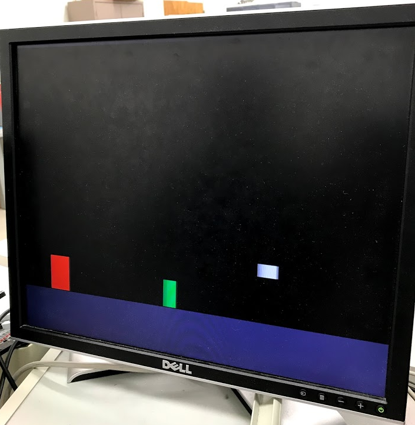
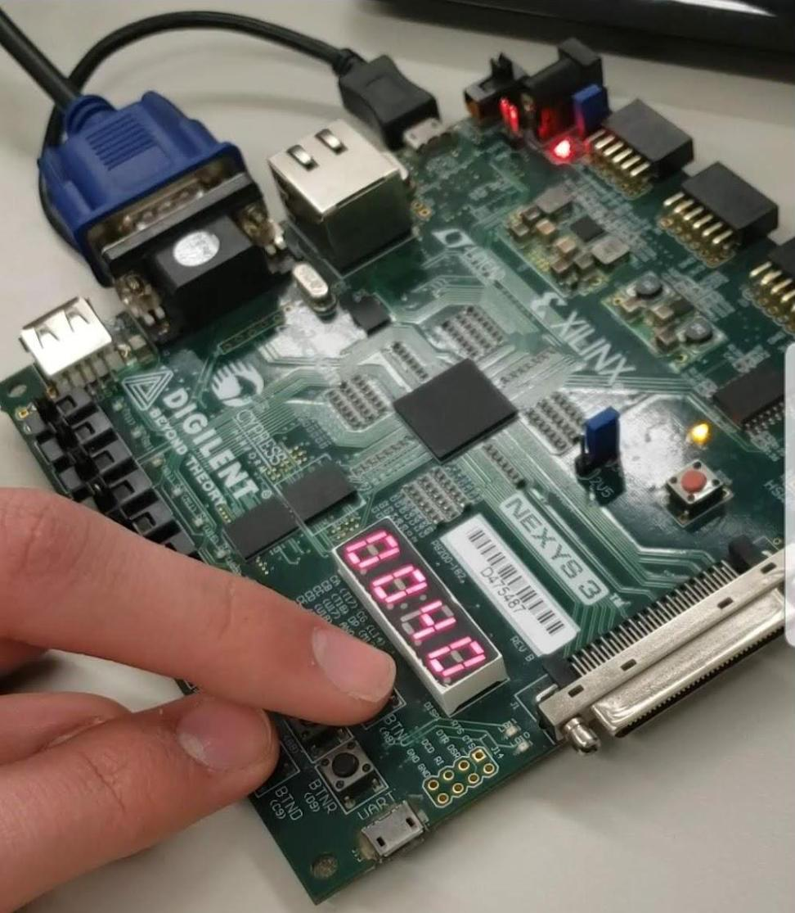

# ChromeDino FPGA
A simple version of the [Google Chrome Dinosaur game](https://chromedino.com/) implemented in Verilog RTL that runs on fpgas

Currently the code is targeted for the Nexys3 rev B board.

## Here we can see a working demo of the project:

As we can see the graphics are quite simplified from the original game. The red character is the dinosaur, the green rectangle is a cactus, and the white square is a bird.

The game is controlled by the button d-pad on the board, and the player's score is displayed on the 7-segment display included on the board

## A full explanation of the project is included in Report.pdf